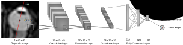

## Training a CNN to track eye movements in high-speed MRI data using only artificial training data
The goal of this project was to track eye movements in high-speed MRI data using a Convolutional Neural Network (CNN). 
However, there is currently no appropriate dataset of MRI eyeball footage along with the parameters of interest, 
eyeball center and gaze angle. Therefore, I created artificial MRI data of human eyeballs which have the advantage that 
ground truth eyeball center and gaze angle are known parameters. The model was then trained exclusively on artificial 
data, but is able to generalise to real MRI data as demonstrated by the video footage below. This is real MRI data of a 
participant looking back and forth between two targets ca. 20° apart. The trained CNN model is able to correctly 
predict the gaze trajectory switching between the two targets.

## Artificial MRI data
The artificial data was based on realistic human eyeball shape properties and the images were designed to mimic typical 
properties of MRI data like pixelation & blur. A large variability in background noise, shape parameters, eyeball center 
and gaze angles were chosen in order to ensure that the model generalises to real MRI eyeball data. See below a 
comparison of real (left) and artificial (right) MRI data of a human eyeball with similar shape, center and gaze angle.

## Network Architecture
I chose a simple Convolutional Neural Network with 3 blocks of convolution layers and 3 sets of fully-connected layers. 
Each convolution consists of a 2D Convolution with same padding, Batch Normalization, Relu Activation function and a 
Max-Pooling layer. Inputs are (43,43) grayscale images and outputs are eyeball center coordinates $(x_0, y_0)$, as well 
as the gaze angle $\alpha$.

## Performance on artificial test data
To estimate the performance of the CNN model, predicted and ground truth output values are compared for a test set of 
8000 artificial images not included in the training data. Apparently, eyeball center position can be estimated with a 
sub-pixel precision of below 0.2 pixel while gaze angles wre estimated with a precision of just below 1°. However, this 
relates only to artificial data, so the performance on real data might be a bit worse.

